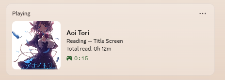

# Visual Novel RPC

Show the visual novel you're reading on your **Discord profile**: game name, current chapter or route, time read and cover.



Windows tray app. It reads the title of the VN's window, so it works with most engines without any setup.

## Features

- **Auto-detects the VN** you're playing (Ren'Py, KiriKiri, Siglus, Unity, …), or lets you pick the window by hand.
- **Shows where you are**: prologue, chapter, route, ending… read straight from the window title (EN / FR / JP).
- **Tracks time read** per VN, saved between sessions.
- **Covers** from VNDB, an image URL or a local file, with a built-in crop tool.
- **Steam names**: installed Steam games get their proper name automatically.
- **Library** of every VN you've played, with time read and a Play button.
- **Privacy per game**: Full, Partial (no chapter), Private (just "Visual Novel") or Off.
- NSFW covers are blurred and never sent to Discord unless you allow it.
- Optional **launch at Windows startup**.

## Install

Download `VisualNovelRPC.exe` and run it. Nothing else is needed.

Discord desktop must be open, with **Settings → Activity Privacy → Share your detected activities** turned on.

## Use your own Discord app (optional)

The app already works out of the box. If you want your own name and default image on Discord:

1. Create an application at <https://discord.com/developers/applications>.
2. Paste its **Application ID** in the app under **Settings → Discord Application ID**.
3. In **Rich Presence → Art Assets**, upload an image named `vn_cover`. It's shown when a cover can't be displayed on Discord (local files and cropped images).

## Run from source

Python 3.10+ on Windows.

```
pip install -r requirements.txt
python -m vnrpc
```

## Build the .exe

```
pip install -r requirements-dev.txt
python build.py
```

The result is `dist\VisualNovelRPC.exe`. Close the app before building.

## Tests

```
python -m pytest -q
python tools/fake_vn_window.py --title "Grisaia no Kajitsu - Yumiko Route - Chapter 4"
```

`fake_vn_window.py` opens a dummy window so you can test detection without a real VN.

## Where settings are saved

Everything is in `%APPDATA%\VisualNovelRPC\`:

| File | What |
|---|---|
| `config.yaml` | app settings |
| `games\<title>.yaml` | one file per VN (safe to edit or rename) |
| `cache\` | VNDB results and covers |
